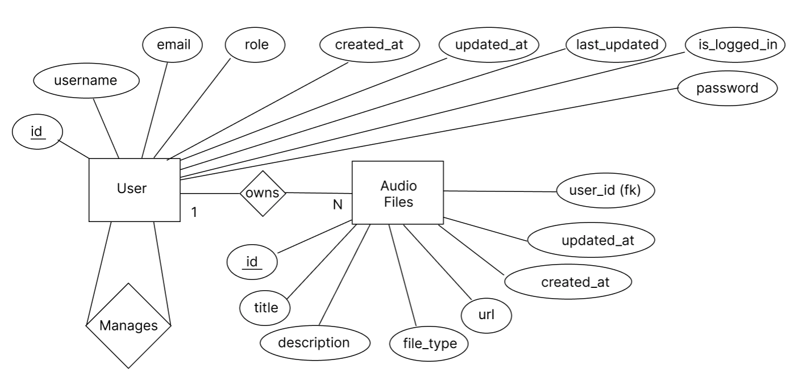

# Atmo Database

### 1. Description

The database is an sqlite database and belongs to the application. It consists of two tables User and Audio_File which have a 1 to many relationship.
Models for the database are in models.py and are created with [SQLModel](https://sqlmodel.tiangolo.com/). SQLModel has the advantage of [sanitizing user input](https://sqlmodel.tiangolo.com/db-to-code/?h=injection#sql-sanitization) that come through the models by default and so avoiding the problem of SQL injection.

### 1.1 ERD Diagram

### 1.2 Data
Some data displayed in the application for Audio Files is faux data and simply exists as samples rows in html. Other data for Audio Files pulls from the Audio_File table however functionality to upload audio files does has yet to be implemented. Where this data exist in the database it has been added through sql inserts directly through sqlite. The inserts.sql file was used during development for this purpose and can be ignored.

As described previously in the main README file, there a number of accounts already in the database. They have either standard, admin, or owner privileges. See table below for reference. Standard users can only see and manage their own files. Admins and owners can access the Admin area and manage standard users. Only the owner can elevate the privileges of a standard user to admin. Any user who registers is set to standard user by default. **The application currently only accepts sign-up with a ncirl.ie domain.** Passwords can be between 8 to 20 characters inclusive and must have and uppercase, lowercase, number and special character. Not all special characters will be accepted.

|#|Username|Email|Privilege|Password|
|-|--------|-----|---------|--------|
|1|Alice|alice@ncirl.ie|standard|P@ssword123|
|2|Bob|bob@ncirl.ie|owner|P@ssword123|
|3|Carla|carla@ncirl.ie|admin|P@ssword123|
|4|Dan|dan@ncirl.ie|standard|P@ssword123|
|5|Emma|emma@ncirl.ie|standard|P@ssword123|
|6|Fran|fran@ncirl.ie|standard|P@ssword123|
|7|Greg|greg@ncirl.ie|standard|P@ssword123|
|8|Helen|helen@ncirl.ie|standard|P@ssword123|

